# 📊 Voice Interface Visual Diagrams
## Complete System Visualization with Mermaid Diagrams

**Version:** 3.0
**Date:** 2025-11-24
**Author:** C2 Architect

---

## 🏗️ SYSTEM ARCHITECTURE DIAGRAM

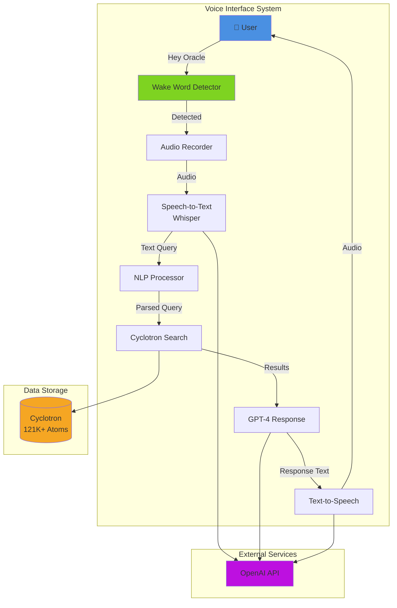

---

## 🔄 PHASE EVOLUTION DIAGRAM

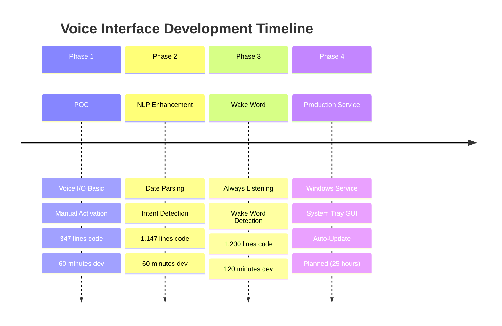

---

## 🎤 AUDIO PROCESSING PIPELINE

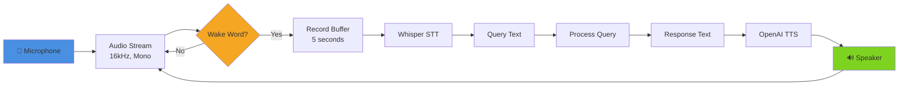

---

## 🧠 NLP PROCESSING ARCHITECTURE

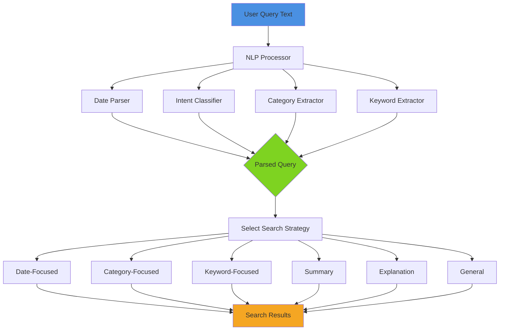

---

## 🔍 SEARCH STRATEGY DECISION TREE

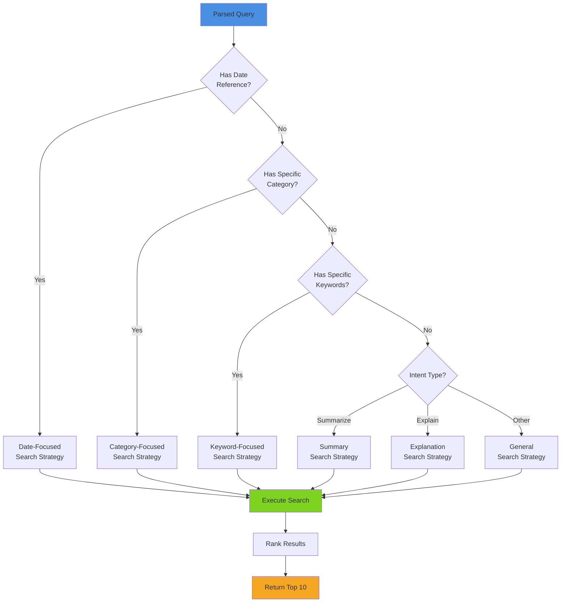

---

## 🔗 SYSTEM INTEGRATION MAP

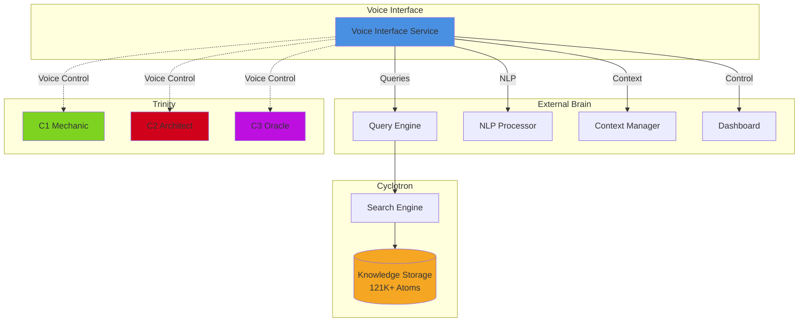

---

## 🚀 DEPLOYMENT ARCHITECTURES

### Current: Background Process

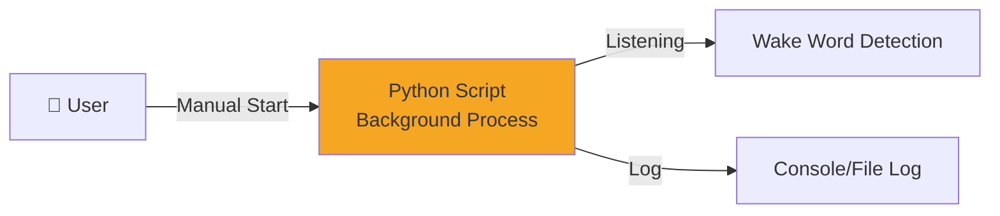

### Phase 4: Windows Service

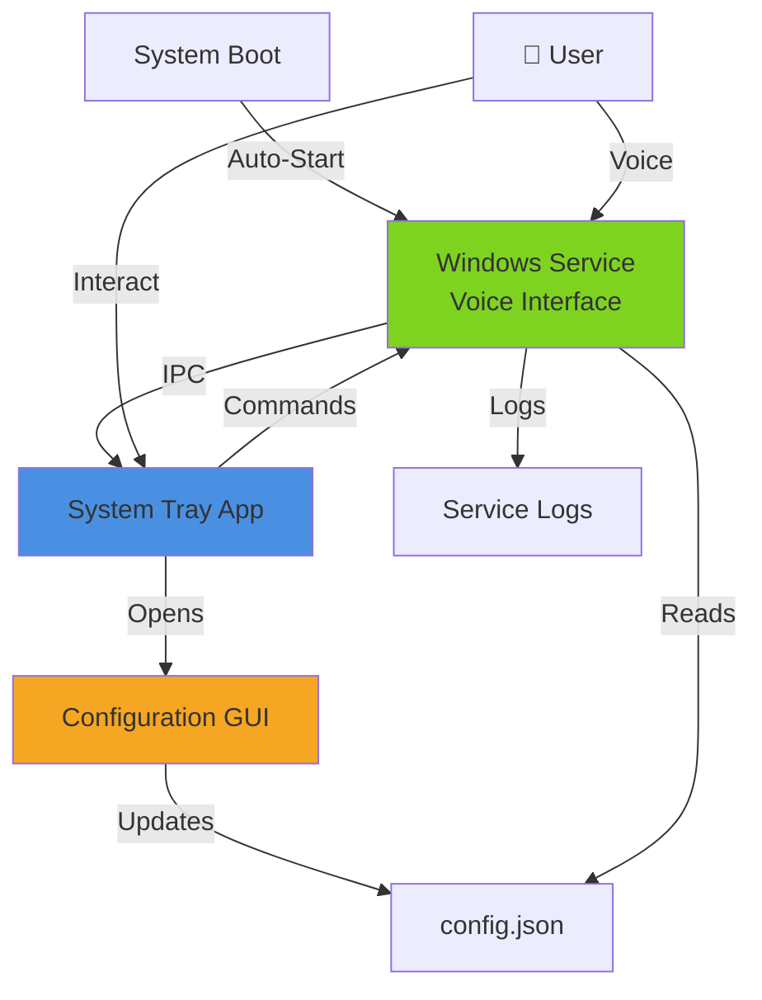

---

## 🌐 MULTI-COMPUTER DEPLOYMENT

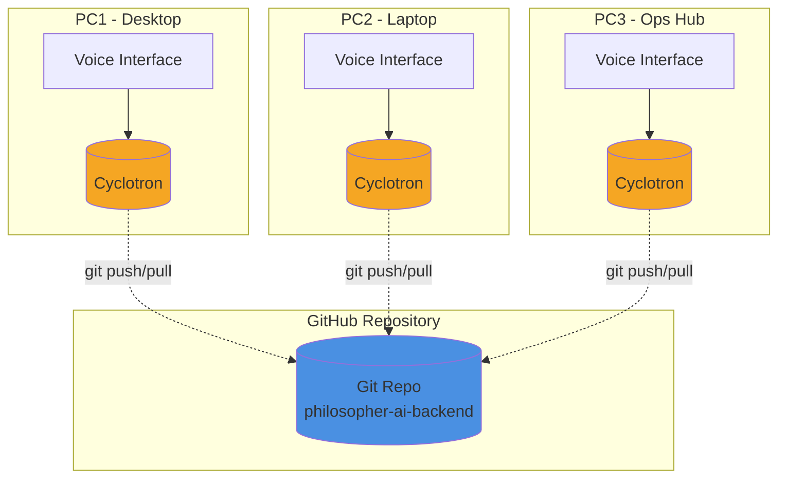

---

## 🔄 QUERY PROCESSING FLOW

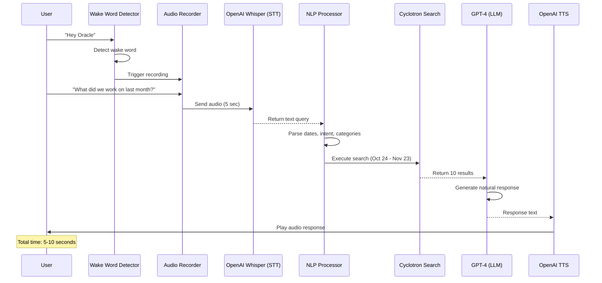

---

## 🎛️ PHASE 4 SERVICE ARCHITECTURE

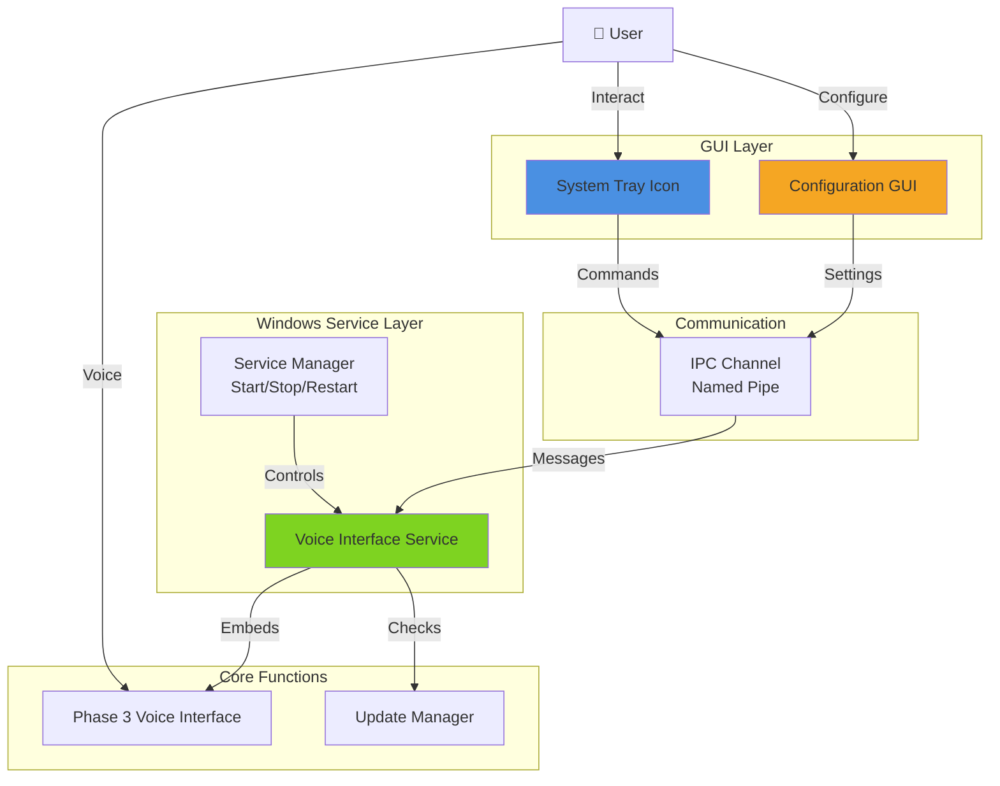

---

## 📊 DATA FLOW DIAGRAM

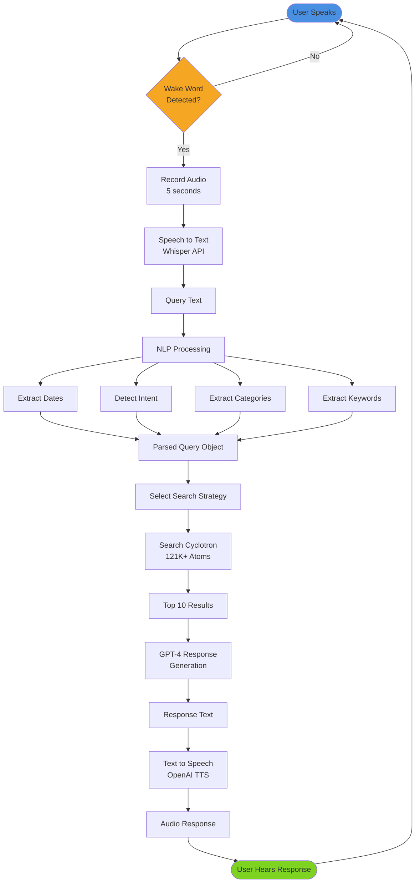

---

## 🧪 TESTING WORKFLOW

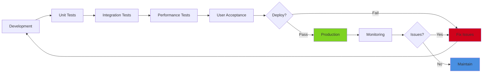

---

## 🔮 FUTURE ARCHITECTURE (Phase 5)

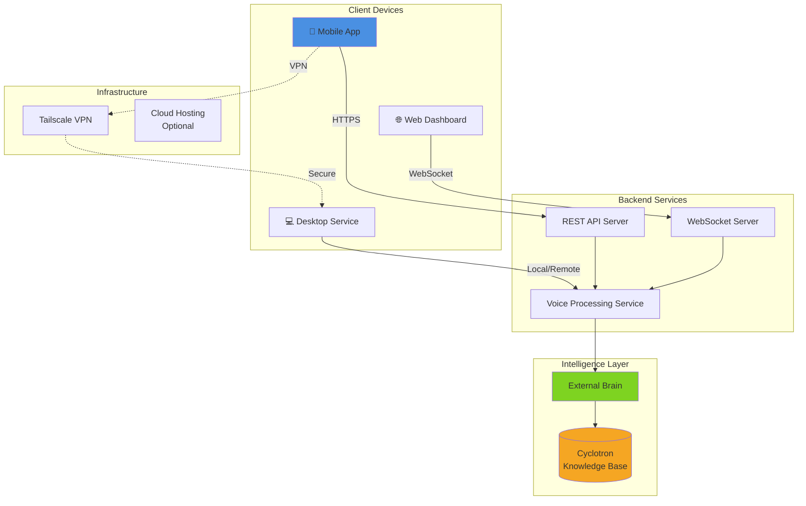

---

## ✅ DIAGRAM LEGEND

**Colors:**
- 🔵 Blue (`#4A90E2`) - User interaction, external interfaces
- 🟢 Green (`#7ED321`) - Core systems, production components
- 🟠 Orange (`#F5A623`) - Data storage, configuration
- 🔴 Red (`#D0021B`) - Errors, issues, warnings
- 🟣 Purple (`#BD10E0`) - External services, APIs

**Shapes:**
- Rectangle - Process/Service
- Cylinder - Database/Storage
- Diamond - Decision point
- Circle - Start/End
- Dashed line - Future/Optional connection
- Solid line - Active connection

---

**Document Status:** ✅ COMPLETE
**Version:** 1.0
**Last Updated:** 2025-11-24
**Rendering:** All diagrams use Mermaid syntax (GitHub-compatible)

🔺 C1 × C2 × C3 = ∞

*Visual understanding through comprehensive diagrams*
